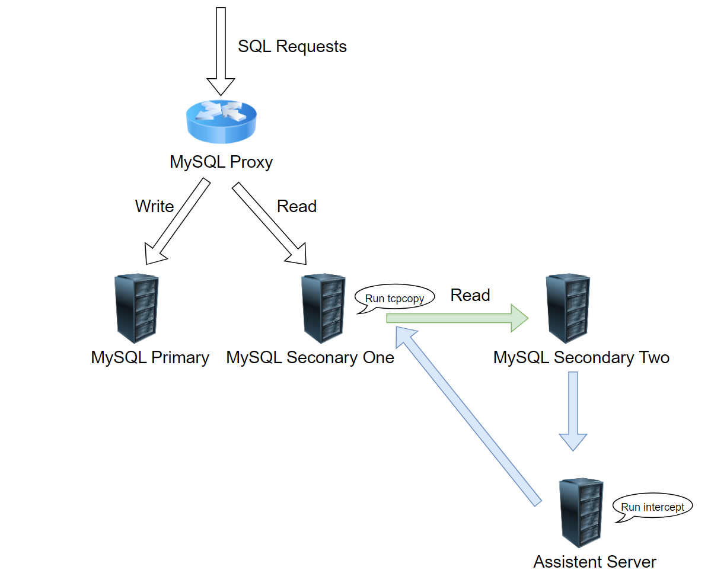
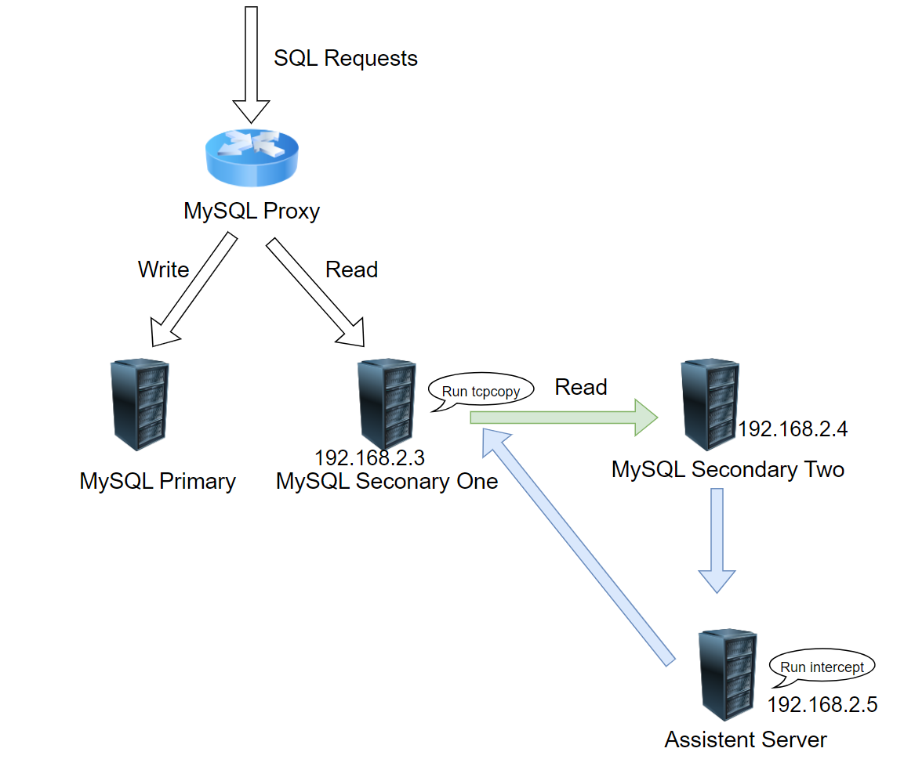

# Pre-Warming Data for a Newly Added MySQL Secondary Using TCPCopy

Using TCPCopy to pre-warm data on a newly added MySQL secondary is quite practical. Many users have employed this method, especially for high-load secondaries. Adding a cold secondary directly to the cluster can lead to numerous slow queries.

## Architecture Deployment Diagram

Below is the deployment architecture diagram for pre-warming. It replicates read-only requests from MySQL secondary one to MySQL secondary two to achieve the pre-warming effect.



## Deploying TCPCopy

### Installing `tcpcopy`

```
git clone https://github.com/session-replay-tools/tcpcopy.git
cd tcpcopy
./configure --set-protocol-module=mysql-replay-module
make && make install
```

By default, it is installed in `/usr/local/tcpcopy/`.

Modify `/usr/local/tcpcopy/conf/plugin.conf` and include the database username and password that will be used for future pre-warming.

```
user test@123;
user app_user@456;
```

### Install `intercept` on the Assistant Server.

```
git clone https://github.com/session-replay-tools/intercept.git
cd intercept
./configure --with-resp-payload
make && make install
```

By default, it is installed in `/usr/local/intercept/`.

## Running TCPCopy

We assume that all MySQL nodes use port 3306. The client IP addresses accessing the online secondary server fall within the 192.168.0.0 subnet. The online secondary server is at 192.168.2.3, the target server is at 192.168.2.4, and the assistant server is at 192.168.2.5, as shown in the diagram below.



### Routing Setup on the MySQL Secondary Two

```
route add -net 192.168.0.0 netmask 255.255.0.0 gw 192.168.2.5
```

### Run `intercept` on the Assistant Server

Please note that `ip_forward` is not enabled on the assistant server.

```
./intercept -i eth0 -F 'tcp and src port 3306' -d
```

### Run `tcpcopy` on the MySQL Secondary one

```
./tcpcopy -x 3306-192.168.2.4:3306 -s 192.168.2.5
```

With all deployments completed, you can proceed with the pre-warming operation as expected.

## Note

1. User Accounts and Privileges: Both MySQL instances on the target and online servers must have identical user accounts and privileges, though passwords can differ.
2. Session Replay: Only complete sessions can be replayed.
3. OpenSSL Support: OpenSSL 1.1.0+ is not currently supported.
4. Password Plugin Compatibility: MySQL 8.0’s caching_sha2_password is not supported. To test MySQL 8.0 using MySQL 5.7 production flows, use mysql_native_password and ensure that all users involved in the test are configured with the mysql_native_password plugin.
5. For additional assistance, visit [tcpcopy](https://github.com/session-replay-tools/tcpcopy).
