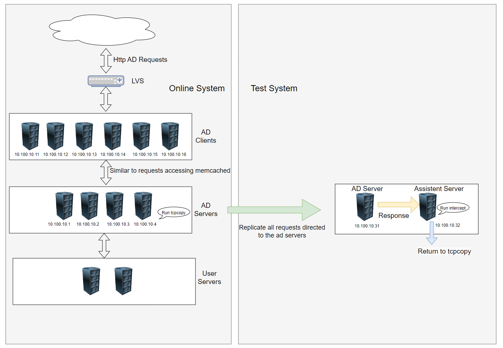
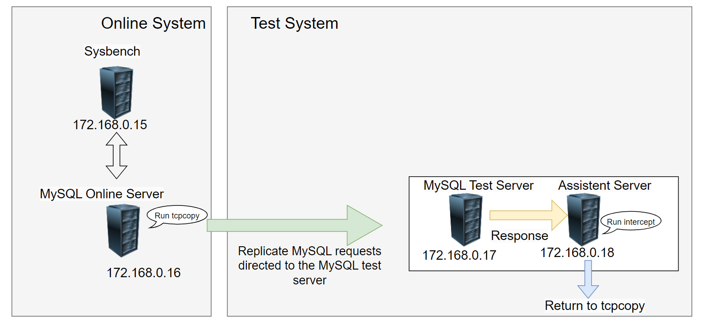

# TCPCopy Examples

If the reader has not yet read the two articles below, please do so first to facilitate understanding of the subsequent examples.

1. [An Overview of TCPCopy for Beginners](https://session-replay-tools.github.io/tcpcopy/doc/Beginners.html)

2. [A General Overview of TCPCopy Architecture](https://session-replay-tools.github.io/tcpcopy/doc/Architecture.html)

Back to the main topic, this article will illustrate the value of TCPCopy through three examples to deepen the user's understanding of it.

## 1. Copying Private Protocols to the Test System

The following example demonstrates how TCPCopy can be configured for a network application. The goal is to replicate online ad server requests to the ad server in a test environment.



The relevant information in the figure is described as follows:

- The online ad servers have four servers called by ad clients, with client IP addresses originating from ad client machines in the same network segment.
- Suppose the ad server IPs are `10.100.10.1`，`10.100.10.2` ，`10.100.10.3` and `10.100.10.4`, and ad client IPs are `10.100.10.11`, `10.100.10.12`, `10.100.10.13`，`10.100.10.14`，`10.100.10.15`  and `10.100.10.16`.
- The test ad server’s IP is `10.100.10.31`, and the assistent server’s IP is `10.100.10.32`.
- We assume that all ad server programs are listening on port 11311.

Here are the three main steps for deploying and running TCPCopy:

**1. Set Up Routing on the Test AD Server**

Below are the routing settings we configured on the test ad server to prevent responses from returning to the ad clients:

```shell
route add -host 10.100.10.11 gw 10.100.10.32
route add -host 10.100.10.12 gw 10.100.10.32
route add -host 10.100.10.13 gw 10.100.10.32
route add -host 10.100.10.14 gw 10.100.10.32
route add -host 10.100.10.15 gw 10.100.10.32
route add -host 10.100.10.16 gw 10.100.10.32
```

**2. Running intercept on the Assistent Server**

`./intercept -i eth0 -F 'tcp and src port 11311' -d` 

Here, we assume the network card interface is set to eth0.

**3. Running tcpcopy on the AD Servers**

`./tcpcopy -x 11311-10.100.10.31:11311 -s 10.100.10.32 -d`

This completes the TCPCopy deployment, allowing us to replicate requests from four ad servers to a single test ad server for various testing purposes, such as performance testing, bug discovery, and stability assessment.

This configuration is quite classic and well-suited for projects that do not directly interface with external network clients, such as those accessing application servers like Tomcat and Redis.

## 2. Copying MySQL Requests to Test Systems

MySQL is a stateful protocol, so directly using TCPCopy to replicate MySQL requests will not succeed. To support MySQL request replication, we developed a TCPCopy module specifically for the MySQL protocol. For detailed information, please visit [MySQL replay](https://github.com/session-replay-tools/mysql-replay-module)

To successfully conduct testing of MySQL applications, consider the following details:

1. Follow the deployment requirements in the documentation precisely.
2. Ensure the username and permissions configured on the MySQL test server match those on the MySQL online server.  
3. MySQL must use native password authentication; otherwise, it will not function properly.
4. Sysbench initiates requests on the production side, and TCPCopy is started before this to capture complete session data packets.

Assume the machine at 172.168.0.15 runs Sysbench, 172.168.0.16 hosts the online MySQL service, 172.168.0.17 runs the test MySQL service, and 172.168.0.18 is designated as the assistent server.



**Set Up Routing on the MySQL Test Server**

route add -host 172.168.0.15 gw 172.168.0.18

**Running intercept on the Assistent Server**

`./intercept -i eth0 -F 'tcp and src port 3306' -d` 

**Running TCPCopy on the MySQL Online Server**

`./tcpcopy -x 3306-172.168.0.17:3306 -s 172.168.0.18 -d`

On 172.168.0.15, the Sysbench script to simulate online requests is as follows:

`sysbench --debug=off --test=oltp --mysql-table-engine=innodb --oltp-test-mode=complex --oltp-table-size=10000 --mysql-socket=/tmp/mysql.sock --num-threads=20 --max-requests=0 --mysql-user=test --mysql-password=yyyyyy    --mysql-host=172.168.0.16  run`

**The final results of the request replication are as follows:**

```shell
MySQL access log recorded on the MySQL online server：
[root@16 tmp]# ll access.log
-rw-rw---- 1 mysql mysql 1160590772 Feb 14 14:34 access.log

MySQL access log recorded on the MySQL test server：
[root@17 tmp]# ll access.log
-rw-rw---- 1 mysql mysql 1160696291 Feb 14 14:34 access.log
```

From the data above, we can see that the MySQL access logs are generally similar.

## 3. Packet Capture and Transmission via the pcap Interface

In an online system, `tcpcopy` can be configured with the following command:

```shell
./configure --pcap-send --pcap-capture
```

This configuration allows `tcpcopy` to leverage the `pcap` mechanism to capture and transmit packets directly at the data link layer, effectively bypassing the IP layer.

### Example of Web Request Replication

The command below demonstrates how to run `tcpcopy` to replicate application requests from an online port to a testing environment:

```shell
./tcpcopy -x <online_port>@<online_machine_mac>-<target_machine_ip>:<target_machine_port>@<next_hop_mac> -s <intercept_machine_ip> -o <output_network_interface> -i <capture_network_interface>
```

We assume that the target server and the online server are on the same network segment. The following command demonstrates how to use tcpcopy to capture and send requests.

```shell
sudo ./tcpcopy -x 80@00:13:21:B2:5E:42-121.55.111.148:18080@00:0F:1F:03:F2:E6 -s 10.110.12.162 -o eth1 -i eth0
```

This command captures requests to port 80 on the online server and forwards them to port 18080 on the target server (IP `121.55.111.148`). Specifically:

- `tcpcopy` captures packets on interface `eth0`.
- Packets are sent from MAC address `00:13:21:B2:5E:42` (associated with `eth1`) and forwarded to the target machine's MAC address `00:0F:1F:03:F2:E6`. Since both are in the same network segment, the next hop MAC is the target machine's MAC.
- `intercept` runs on `10.110.12.162` to capture response packets routed back to the `tcpcopy` system.

### Key Considerations

1. **Matching Network Interface and MAC Address**: The output network interface specified with `-o` must match the MAC address of the outgoing network adapter, and ideally align with the network interface needed to reach the target machine's IP.
2. **MAC Address Alignment**: In the same network segment, the destination MAC should match the target machine’s IP; in different segments, use the next hop's MAC address. `tcpdump` can help identify the MAC address if necessary.
3. **Routing Without IP Layer**: As `tcpcopy` sends packets from the data link layer, IP-based routing is bypassed, requiring explicit configuration of the MAC addresses to manage packet routing.
4. Since packet transmission bypasses the IP layer, it avoids various IP layer issues, including IP conntrack-related problems.
5. This setup enables large-scale replication of online requests, allowing users with the necessary resources to use switch mirroring to replicate traffic.

## Application Scope

Stateless protocols are ideally suited for TCPCopy, while stateful protocols necessitate module development. Many internal protocols used for access, like those for Redis, HTTP, and Memcached, are stateless. In contrast, stateful protocols, including MySQL, WebSocket, and email protocols, require further development efforts. Protocols relying on TLS/SSL are often too complex and expensive to implement; it may be more practical to utilize hardware to offload these protocols and subsequently convert them into simpler alternatives.

Finally, if users require custom development, we will offer corresponding paid services.
